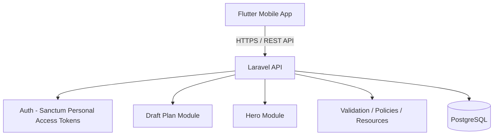

# Project Design Specification

## Overview
**Stack final:**
- **Backend:** Laravel API
- **Auth:** Laravel Sanctum
- **DB:** PostgreSQL
- **Infra:** Docker Compose
- **Mobile Client:** Flutter
- **Note:** No web frontend

---

## 1. Tech Stack

### Backend
- **Framework:** Laravel 11 / 12
- **PHP Version:** PHP 8.3+
- **Architecture:** Laravel API only
- **ORM:** Eloquent ORM
- **Database Management:** Laravel Migrations + Seeder
- **Validation:** Laravel Form Request Validation
- **Response Handling:** Laravel API Resources

### Database
- **Engine:** PostgreSQL

### Infrastructure
- **Orchestration:** Docker Compose
- **Services:**
  - `backend` service
  - `postgres` service

### Mobile
- **Framework:** Flutter
- **State Management:** Cubit / Bloc
- **Architecture:** Clean Architecture folder structure

---

## 2. Project Structure (Mobile)

```text
lib/
  core/
    constants/
    error/
    network/
      dio_client.dart
      api_endpoints.dart
    storage/
      secure_storage_service.dart
    utils/

  features/
    auth/
      data/
        datasources/
        models/
        repositories/
      domain/
        entities/
        repositories/
        usecases/
      presentation/
        cubit/
        pages/
        widgets/

    heroes/
      data/
      domain/
      presentation/

    draft_plans/
      data/
      domain/
      presentation/
        pages/
        widgets/

  injection_container.dart
  main.dart
```

---

## 3. High-Level Architecture (HLA)



### Database Tables
- `users`
- `personal_access_tokens`
- `heroes`
- `draft_plans`
- `draft_plan_bans`
- `draft_plan_preferred_picks`
- `draft_plan_enemy_threats`
- `draft_plan_item_timings`
